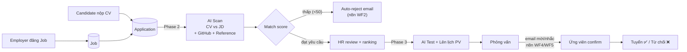

# JobMatch VN — Tổng quan nghiệp vụ (Business Overview)

> 📖 **Mục tiêu:** giúp mọi người trong team nắm nghiệp vụ trong **~10 phút**.
> Đây là bản tóm tắt đặt *trên* PRD. Khi cần chi tiết → xem [docs/plan.md](plan.md).

---

## 1. Bài toán & Giải pháp

**Bài toán:** Tuyển dụng IT thủ công chậm và tốn sức — HR đăng tin, nhận hàng trăm CV,
đọc tay từng cái, tự xếp lịch phỏng vấn, hay quên follow-up.

**Giải pháp (JobMatch VN):** Một nền tảng ATS (Applicant Tracking System) **tự động hóa**
toàn bộ hành trình tuyển dụng bằng AI + workflow automation:

> Đăng tuyển → Ứng viên nộp CV → **AI so khớp CV–JD** + tra GitHub + xác nhận người tham chiếu →
> **Tự động xếp lịch phỏng vấn** + gửi email mời/nhắc → Tuyển dụng.

Điểm khác biệt cốt lõi: **AI screening + auto-scheduling** thay thế công việc thủ công của HR.

---

## 2. Ba vai trò người dùng

| Vai trò | Mục tiêu chính | Quyền nổi bật |
|---|---|---|
| **Ứng viên (Candidate)** | Tìm việc phù hợp, nộp CV, nhận phản hồi nhanh | Tìm kiếm việc (semantic + filter), nộp CV, theo dõi trạng thái ứng tuyển, chat với AI tư vấn, chat với HR, làm bài test |
| **Nhà tuyển dụng (Employer / HR)** | Đăng tuyển nhanh, sàng lọc CV hiệu quả, phỏng vấn đúng người | CRUD company/job, xem ranking ứng viên (AI đã chấm điểm), mời test, xếp lịch phỏng vấn, xem insights, quản lý reference verification |
| **Quản trị (Admin)** | Vận hành & kiểm soát hệ thống | Duyệt/xác thực công ty, quản lý user, gói subscription, xem audit logs |

---

## 3. Luồng nghiệp vụ chính (Happy Path)

**Đọc luồng:** Một Application (lần nộp CV) đi qua nhiều "stage": `pending → viewed → screening → interview → offered → hired/rejected`. AI và n8n **tự động đẩy** ứng viên qua các stage thay HR làm thủ công.

---

## 4. Tự động hóa bằng n8n (6 Workflow)

Đây là "bộ não" tự động — backend chỉ **kích hoạt (trigger)** qua webhook, n8n lo phần còn lại (gọi AI, gửi email).

| WF | Tên | Khi nào kích hoạt | Hành động |
|---|---|---|---|
| 1 | CV Scan Trigger | Backend có application mới | Gọi LLM scan CV + tra GitHub + reference → trả điểm match |
| 2 | Auto Reject | Match score < ngưỡng | Gửi email từ chối lịch sự |
| 3 | Reference Verify | HR yêu cầu verify người tham chiếu | Gửi email cho người tham chiếu (có link xác nhận) |
| 4 | Interview Invite | HR tạo slot phỏng vấn | Gửi email mời + nút Confirm/Cancel |
| 5 | Interview Reminder | Cron mỗi 15 phút | Nhắc trước 24h / 2h / 15p trước giờ PV |
| 6 | AI Test Assign | HR giao bài test | Gửi email link làm bài (có token, có hạn) |

Chi tiết: [n8n-workflows/](../n8n-workflows/) và phần [10. PRD](plan.md).

---

## 5. Ba Phase giao sản phẩm

Dự án chia 3 đợt báo cáo — mỗi Phase là một mảng nghiệp vụ hoàn chỉnh:

| Phase | Nghiệp vụ | Giá trị cho người dùng | Báo cáo |
|---|---|---|---|
| **1 — ATS cơ bản** | Web tuyển dụng: đăng job, nộp CV, tìm kiếm | Có nền tảng đăng & ứng tuyển thật sự (như TopCV/ITviec) | Tuần 5 |
| **2 — Auto-screening** | AI scan CV theo JD, tra GitHub, verify references, ranking | HR không cần đọc tay: AI đã chấm điểm + xếp hạng ứng viên | Tuần 9 |
| **3 — Scheduling + AI Test** | Bài test AI (IQ/English) + tự động xếp lịch + email mời/nhắc | Toàn bộ phễu tự động từ nộp CV → phỏng vấn | Tuần 15 |

---

## 6. Ma trận: Tính năng × Vai trò × Phase

| Tính năng | Ứng viên | HR | Admin | Phase |
|---|:--:|:--:|:--:|:--:|
| Đăng ký / đăng nhập (email + OAuth) | ✅ | ✅ | ✅ | 1 |
| CRUD hồ sơ công ty | — | ✅ | ✅(duyệt) | 1 |
| Đăng & quản lý Job | — | ✅ | — | 1 |
| Tìm việc (semantic + filter) | ✅ | — | — | 1 |
| Nộp CV / theo dõi ứng tuyển | ✅ | ✅(xem) | — | 1 |
| Chat AI tư vấn nghề nghiệp | ✅ | — | — | 1 |
| **AI scan & ranking CV–JD** | — | ✅ | — | 2 |
| Tra cứu GitHub profile | — | ✅ | — | 2 |
| Reference verification | — | ✅ | — | 2 |
| **Bài test AI (IQ / English)** | ✅(làm) | ✅(giao) | — | 3 |
| **Tự động xếp lịch phỏng vấn** | ✅(confirm) | ✅(tạo) | — | 3 |
| Email mời / nhắc phỏng vấn | ✅ | ✅ | — | 3 |
| Quản lý gói subscription | ✅(mua) | ✅(mua) | ✅ | 1+ |
| Audit logs | — | — | ✅ | 1+ |

---

## 7. Thuật ngữ (Glossary)

| Thuật ngữ | Ý nghĩa |
|---|---|
| **ATS** | Applicant Tracking System — hệ thống theo dõi ứng viên (chính là product này) |
| **JD** | Job Description — mô tả công việc |
| **CV parsing** | AI trích xuất cấu trúc CV (skills, kinh nghiệm, học vấn) ra JSON |
| **Semantic match** | So khớp nghĩa giữa CV và JD bằng vector (không chỉ khớp từ khóa) |
| **pgvector** | Extension PostgreSQL lưu vector → dùng cho semantic match + tìm kiếm |
| **Re-rank** | AI chấm lại / sắp xếp lại danh sách ứng viên đã lọc thô |
| **Reference verification** | Xác nhận người tham chiếu (cựu quản lý/đồng nghiệp) về ứng viên |
| **Anonymous mode** | Ứng viên ẩn danh khi nộp (gói trả phí) |
| **Plan / Quota** | Gói Free/Light/Pro, giới hạn số thao tác (AI chat, CV score, post job...) |
| **Stage** | Giai đoạn của application: pending → viewed → screening → interview → offered → hired |
| **n8n** | Tool workflow automation self-hosted, thực hiện các luồng tự động (gửi email, gọi AI) |
| **Dialogflow CX** | Chatbot của Google, xử lý hội thoại tư vấn nghề nghiệp |

---

## 8. Đi sâu hơn

- 📋 **PRD đầy đủ** (yêu cầu chức năng, API, schema, kiến trúc): [docs/plan.md](plan.md)
- 🗄️ **Database**: [docs/database-setup.md](database-setup.md) + schema ở [backend/src/db/schema/](../backend/src/db/schema/)
- 🤖 **n8n workflows**: [n8n-workflows/](../n8n-workflows/)
- 🏗️ **Kiến trúc kỹ thuật**: mục [6. PRD](plan.md) + [README.md](../README.md) (Tech Stack)

> Khi code một tính năng, luôn đối chiếu **ma trận Phase** để biết feature thuộc Phase nào và **glossary** để dùng đúng thuật ngữ trong code/UI.
