# JobMatch VN — n8n và AI hoạt động như thế nào?

> **Mục tiêu:** giúp thành viên trong nhóm hiểu nhanh **n8n làm gì**, **AI làm gì**, hai phần phối hợp với backend như thế nào và dữ liệu đi qua hệ thống theo những luồng nào.
>
> Tài liệu này mô tả kiến trúc theo source code hiện tại. Một số workflow vẫn đang trong quá trình hoàn thiện; xem mục **9. Trạng thái triển khai hiện tại** trước khi tích hợp.

---

## 1. Tóm tắt trong 1 phút

JobMatch VN chia trách nhiệm thành ba phần:

| Thành phần | Trách nhiệm chính |
|---|---|
| **Backend** | Xử lý nghiệp vụ, xác thực và phân quyền, đọc/ghi database, tạo queue job, quyết định khi nào gọi AI hoặc kích hoạt n8n |
| **AI — Google Gemini** | Hiểu và sinh nội dung: parse CV, chấm CV theo JD, tạo JD, viết cover letter, tạo/chấm bài test, chatbot và embedding |
| **n8n** | Điều phối các tác vụ tự động bên ngoài: gửi email, chạy workflow theo webhook/cron, gọi callback về backend và ghi nhận kết quả workflow |

Nguyên tắc quan trọng:

> **Backend giữ quyền quyết định và dữ liệu chuẩn; AI phân tích nội dung; n8n tự động hóa quy trình.**

n8n không thay thế backend và AI không tự ý cập nhật dữ liệu. Mọi kết quả quan trọng đều phải được backend kiểm tra trước khi lưu vào PostgreSQL.

---

## 2. Ranh giới trách nhiệm

### 2.1 Backend làm gì?

Backend là trung tâm điều phối:

- Nhận request từ frontend.
- Xác thực người dùng và kiểm tra quota.
- Đọc CV, JD, application, interview và test từ PostgreSQL.
- Đưa tác vụ dài vào BullMQ để chạy nền.
- Gọi Gemini qua AI provider.
- Kiểm tra, tổng hợp và lưu kết quả AI.
- Kích hoạt n8n bằng HTTP webhook khi cần gửi email hoặc chạy automation.
- Ghi log kết quả gọi n8n vào `n8n_workflow_logs`.

### 2.2 AI làm gì?

AI hiện dùng một provider duy nhất là **Google Gemini**, nhưng chia model theo loại công việc:

| Model/role | Công việc |
|---|---|
| `gemini-1.5-flash` | Parse CV, chatbot và các tác vụ cần phản hồi nhanh |
| `gemini-1.5-pro` | Chấm CV theo JD, sinh JD, cover letter, sinh/chấm AI test |
| `text-embedding-004` | Tạo vector cho CV/JD để tìm kiếm và so khớp ngữ nghĩa |

AI chịu trách nhiệm xử lý nội dung khó viết hoàn toàn bằng rule:

1. **CV parsing:** biến nội dung PDF/DOCX thành JSON có cấu trúc.
2. **CV–JD scoring:** chấm mức phù hợp theo rubric 100 điểm.
3. **Content generation:** sinh JD và cover letter.
4. **AI test:** sinh câu hỏi IQ/English và chấm câu tự luận.
5. **Chatbot:** tư vấn, hỗ trợ tìm việc và cung cấp salary insight.
6. **Embedding:** chuyển văn bản CV/JD thành vector phục vụ semantic search.

AI **không** nên đảm nhiệm:

- Xác thực và phân quyền.
- Gửi email trực tiếp.
- Tự cập nhật application/interview mà không qua backend.
- Xác nhận tuyệt đối ứng viên đúng hoặc sai; HR vẫn có quyền review/override.
- Thực hiện logic có thể tính chắc chắn bằng code, ví dụ kiểm tra token hết hạn hay phát hiện lịch phỏng vấn bị trùng.

### 2.3 n8n làm gì?

n8n là dịch vụ workflow automation chạy độc lập trong Docker. n8n nhận sự kiện từ backend qua webhook hoặc tự chạy theo lịch cron.

n8n phù hợp với các tác vụ:

- Gửi email từ chối ứng viên.
- Gửi email xác minh người tham chiếu.
- Gửi email mời phỏng vấn.
- Gửi email nhắc phỏng vấn.
- Gửi link bài test.
- Render email template.
- Gọi API callback về backend sau khi một bước bên ngoài hoàn tất.
- Thực hiện retry/error branch cho các tích hợp bên ngoài.

n8n **không** nên là nơi lưu business state duy nhất. Trạng thái application, reference, interview và test vẫn phải được lưu trong PostgreSQL qua backend.

---

## 3. Kiến trúc tổng thể

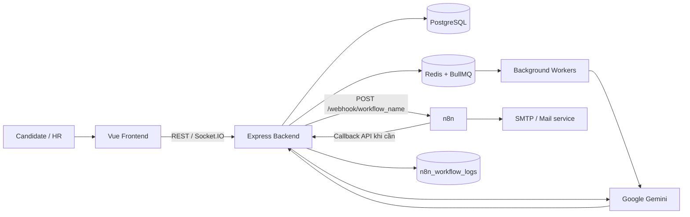

### Luồng gọi n8n chuẩn

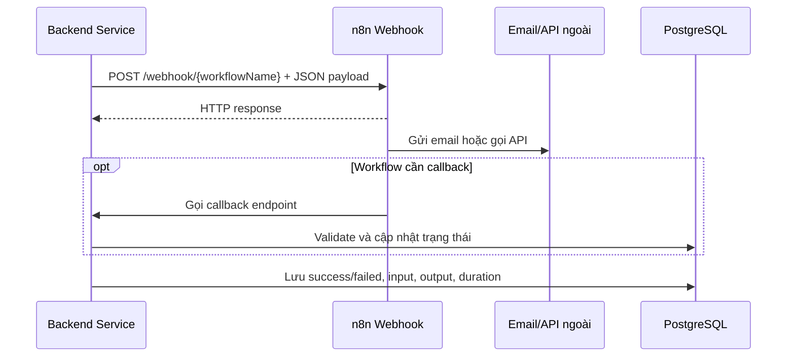

Trong source hiện tại, backend gọi n8n qua `n8nService.trigger(workflowName, payload)`. URL được tạo theo mẫu:

```text
${N8N_BASE_URL}/webhook/${workflowName}
```

Giá trị mặc định:

```text
N8N_BASE_URL=http://localhost:5678
```

Timeout hiện tại của mỗi lần gọi webhook là **30 giây**. Backend ghi cả trường hợp thành công và thất bại vào bảng `n8n_workflow_logs`.

---

## 4. Luồng AI chính

### 4.1 Parse CV khi ứng viên upload

Mục tiêu: chuyển file CV không có cấu trúc thành dữ liệu JSON để các chức năng sau có thể đọc được.

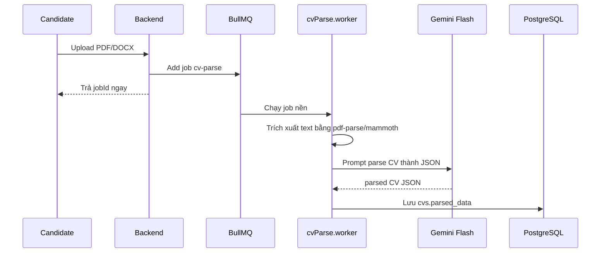

Dữ liệu được trích xuất có thể gồm:

- Họ tên, email, số điện thoại.
- Kỹ năng.
- Học vấn.
- Kinh nghiệm.
- Dự án và chứng chỉ.
- GitHub URL.
- Người tham chiếu.

**Phân công:** BullMQ xử lý bất đồng bộ; Gemini hiểu nội dung CV; backend worker validate và lưu dữ liệu. n8n không tham gia luồng parse CV hiện tại.

### 4.2 Scan CV theo JD

Đây là luồng cốt lõi của Phase 2.

Rubric hiện tại:

| Tiêu chí | Điểm tối đa |
|---|---:|
| Số năm kinh nghiệm | 25 |
| Kỹ năng bắt buộc | 30 |
| Học vấn | 10 |
| Chứng chỉ | 5 |
| Kinh nghiệm trong ngành | 5 |
| Mức phù hợp địa điểm/remote | 5 |
| GitHub | 10 |
| Người tham chiếu | 5 |
| Cover letter | 5 |
| **Tổng** | **100** |

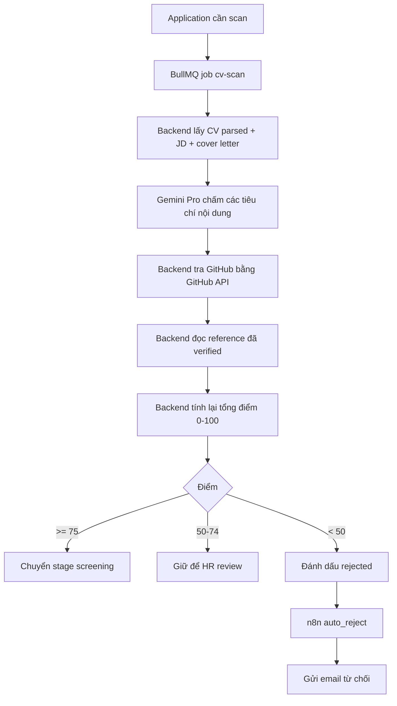

Phân công chi tiết:

- **Gemini:** đánh giá các tiêu chí cần hiểu ngữ nghĩa như kinh nghiệm, kỹ năng, học vấn, cover letter.
- **Backend:** tra GitHub, đọc reference verification, cộng lại tổng điểm, áp dụng threshold và lưu kết quả.
- **n8n:** chỉ gửi email auto-reject khi backend đã quyết định điểm dưới 50.
- **HR:** xem reasoning, có thể kiểm tra hoặc override quyết định tự động.

Kết quả lưu vào application:

- `ai_match_score`: điểm tổng.
- `ai_match_reasoning`: breakdown từng tiêu chí.
- `scan_completed_at`: thời gian hoàn tất.
- `status` và `stage`: trạng thái sau scan.

### 4.3 Sinh JD và cover letter

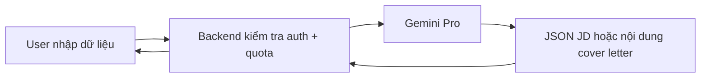

- Sinh JD từ title, industry, level và keywords.
- Sinh cover letter từ dữ liệu CV và mô tả công việc.
- Đây là request đồng bộ, không đi qua n8n.

### 4.4 Chatbot AI

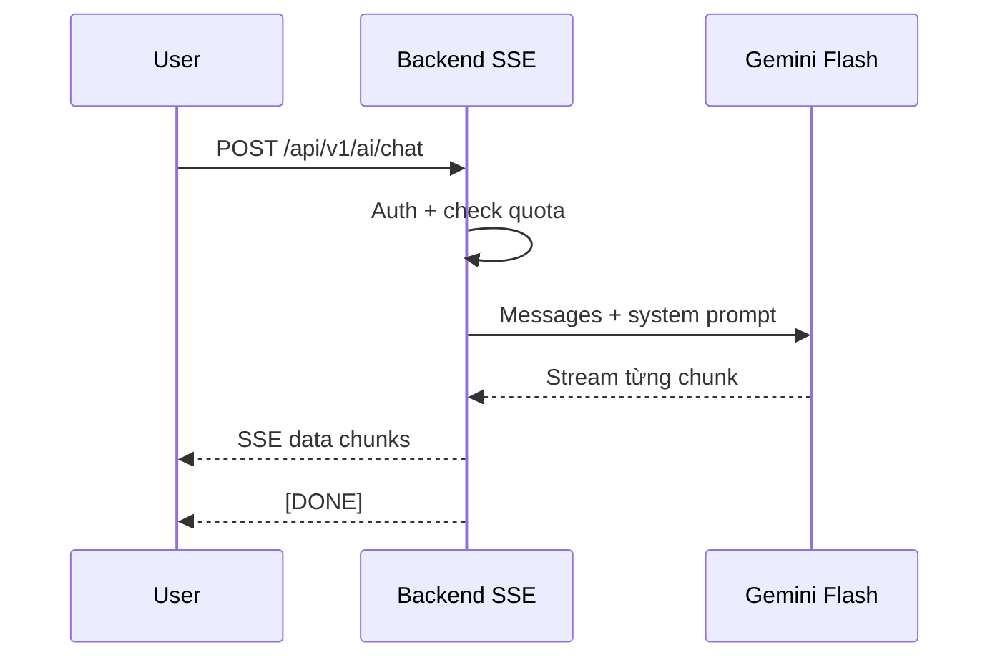

Chatbot có định hướng dùng tool `search_jobs` và `get_salary_insight`. Nội dung trả lời được stream bằng Server-Sent Events để giao diện nhận dần thay vì chờ toàn bộ câu trả lời.

### 4.5 Embedding và semantic search

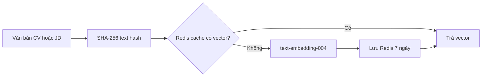

Embedding giúp so khớp theo nghĩa, không chỉ theo từ khóa. Ví dụ “JS” và “JavaScript” hoặc các mô tả kinh nghiệm có nội dung tương tự có thể gần nhau trong không gian vector.

---

## 5. Các workflow n8n

### 5.1 Danh sách webhook đang được backend gọi

| Workflow name | Điểm kích hoạt | Việc n8n cần làm |
|---|---|---|
| `auto_reject` | CV scan có điểm dưới 50 | Render và gửi email từ chối; callback backend nếu workflow được cấu hình như vậy |
| `reference_verify` | HR/backend gửi yêu cầu xác minh reference | Gửi email chứa link token xác minh có hạn 14 ngày |
| `interview_invite` | HR tạo interview slot | Gửi email có thông tin phỏng vấn và link confirm/reschedule |
| `interview_confirmed` | Ứng viên xác nhận lịch | Gửi thông báo xác nhận cho HR và các bên liên quan |
| `interview_cancelled` | Ứng viên hoặc HR hủy lịch | Gửi email hủy và thông tin tiếp theo |
| `interview_reminder` | Đến mốc 24h, 2h hoặc 15 phút | Gửi email/push nhắc lịch |
| `ai_test_assign` | HR giao bài test | Gửi link làm test có access token và hạn sử dụng |

### 5.2 Auto-reject

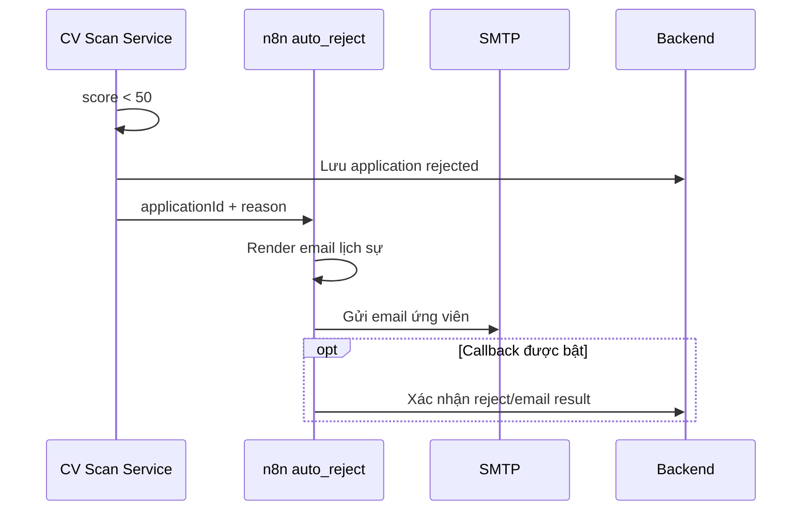

**AI không gửi email.** AI chỉ cung cấp breakdown; backend quyết định threshold; n8n thực hiện giao tiếp qua email.

### 5.3 Reference verification

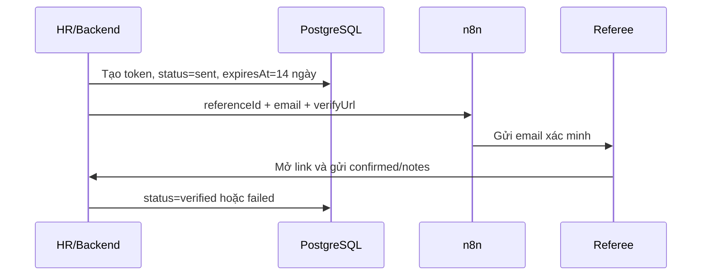

Backend sở hữu token và trạng thái. n8n chỉ nhận địa chỉ email/nội dung cần thiết để gửi thư.

### 5.4 Interview invite và confirmation

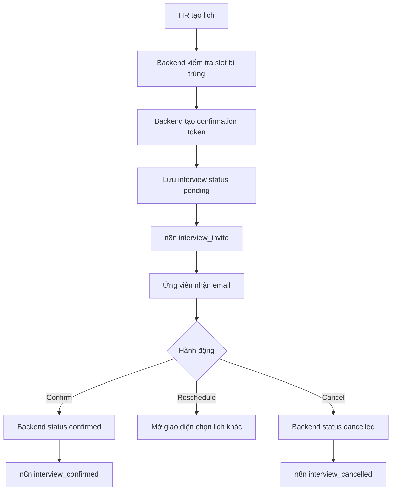

Logic kiểm tra xung đột lịch và cập nhật trạng thái phải nằm ở backend, vì đây là business rule cần tính nhất quán.

### 5.5 Interview reminder

Hệ thống có hai thiết kế liên quan đến reminder:

1. **Thiết kế trong source backend hiện tại:** BullMQ worker chạy định kỳ, backend tìm interview đến hạn rồi gọi webhook `interview_reminder` cho từng lịch.
2. **Workflow JSON hiện có:** n8n Cron chạy mỗi 15 phút, gọi backend để lấy danh sách reminder đến hạn rồi gửi email.

Không nên bật đồng thời hai scheduler vì có thể gửi email trùng. Team cần chọn **một nguồn lập lịch duy nhất**. Khuyến nghị theo source hiện tại:

> BullMQ/backend quyết định interview nào đến hạn; n8n chỉ gửi email/push.

Luồng khuyến nghị:

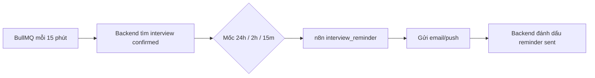

Các cờ chống gửi trùng:

- `reminder_24h_sent`
- `reminder_2h_sent`
- `reminder_15m_sent`

### 5.6 AI test

Luồng này gồm cả AI và n8n, nhưng trách nhiệm tách rõ:

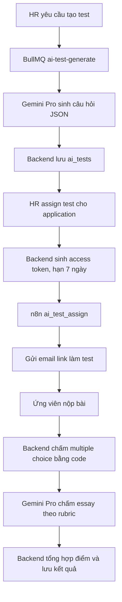

- **Gemini:** sinh đề và chấm câu tự luận.
- **Backend:** tạo token, ẩn đáp án, kiểm tra hạn, chấm multiple choice và lưu điểm.
- **n8n:** gửi email link làm bài.

---

## 6. Luồng end-to-end từ apply đến phỏng vấn

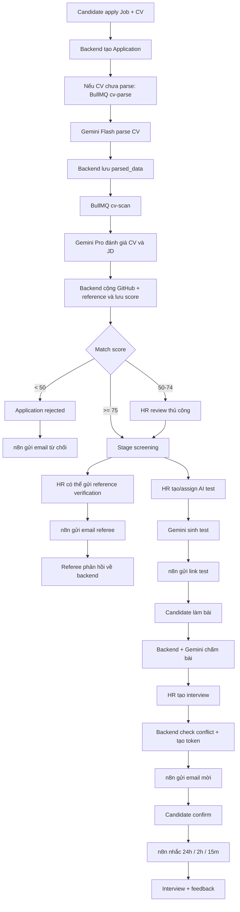

---

## 7. Dữ liệu, bảo mật và độ tin cậy

### 7.1 Payload tối thiểu

Chỉ gửi cho n8n dữ liệu cần cho workflow. Ví dụ email mời phỏng vấn cần:

- `interviewId`
- email/tên ứng viên
- job title
- thời gian, địa điểm, meeting link
- `confirmationUrl`

Không gửi toàn bộ CV, token đăng nhập, password hash hoặc dữ liệu nhạy cảm không liên quan.

### 7.2 Token

- Reference verification token: random 32 bytes, hạn 14 ngày.
- Interview confirmation token: random 32 bytes.
- AI test access token: random 32 bytes, hạn 7 ngày.
- Backend phải kiểm tra token và expiry; n8n chỉ đưa link vào email.

### 7.3 Chống gửi trùng

Mỗi workflow cần idempotency dựa trên ID nghiệp vụ, ví dụ:

- `applicationId + auto_reject`
- `referenceId + reference_verify`
- `interviewId + reminderType`
- `assignmentId + ai_test_assign`

Backend và workflow nên kiểm tra trạng thái trước khi gửi lại. Reminder phải dùng các cờ `*_sent`.

### 7.4 Retry và lỗi

Khi n8n trả lỗi hoặc timeout:

1. `n8nService` ghi `failed`, input, error và duration vào database.
2. Backend không được báo “đã gửi email” nếu webhook thất bại.
3. Workflow nên có retry có giới hạn và error branch.
4. Những tác vụ quan trọng cần có cơ chế gửi lại thủ công từ HR dashboard.
5. Không retry vô hạn vì có thể gửi email trùng.

### 7.5 Kiểm soát đầu ra AI

Kết quả Gemini phải được coi là dữ liệu không đáng tin cậy cho đến khi backend kiểm tra:

- Parse JSON trong `try/catch`.
- Validate schema và giới hạn điểm từng tiêu chí.
- Ép tổng điểm về khoảng 0–100.
- Không hiển thị reasoning nội bộ nhạy cảm cho ứng viên.
- Lưu model/prompt version để audit khi cần.
- Giữ bước HR review cho các quyết định tuyển dụng quan trọng.

---

## 8. Cách chạy và kiểm tra n8n ở local

### 8.1 Khởi động

n8n đã được khai báo trong `docker-compose.yml`:

```bash
docker compose up -d n8n mailhog
```

Truy cập:

- n8n UI: `http://localhost:5678`
- MailHog UI: `http://localhost:8025`

### 8.2 Import workflow

1. Mở n8n UI.
2. Chọn **Workflows → New**.
3. Chọn **Import from File**.
4. Import file JSON trong thư mục `n8n-workflows/`.
5. Cấu hình SMTP/credentials đúng với môi trường.
6. Chọn **Activate**.

### 8.3 Test webhook

```bash
curl -X POST http://localhost:5678/webhook/auto_reject \
  -H "Content-Type: application/json" \
  -d '{"applicationId":"test-application","reason":"Điểm phù hợp dưới ngưỡng"}'
```

Sau khi test, kiểm tra:

- Execution log trong n8n.
- Email trong MailHog.
- Bảng `n8n_workflow_logs`.
- Trạng thái business tương ứng trong PostgreSQL.

### 8.4 Lưu workflow vào Git

Sau khi sửa workflow trong n8n UI:

1. Chọn **Download/Export** workflow.
2. Lưu JSON vào `n8n-workflows/`.
3. Không commit credential hoặc secret vào JSON.
4. Review thay đổi JSON trước khi merge.

---

## 9. Trạng thái triển khai hiện tại

Cần phân biệt rõ **thiết kế mong muốn** và **những file đã có trong repository**.

### Đã có

- n8n container trong Docker Compose.
- `n8nService.trigger()` để backend gọi webhook và ghi log.
- Workflow JSON:
  - `02-auto-reject.json`
  - `03-reference-verify.json`
  - `04-interview-invite.json`
  - `05-interview-reminder.json`
- Backend đã gọi các webhook:
  - `auto_reject`
  - `reference_verify`
  - `interview_invite`
  - `interview_confirmed`
  - `interview_cancelled`
  - `interview_reminder`
  - `ai_test_assign`
- Gemini provider cho chat, parse, generation và embedding.
- BullMQ workers cho CV parse, CV scan, GitHub lookup, AI test generation và interview reminder.

### Chưa đồng bộ hoặc chưa hoàn thiện

- README của `n8n-workflows/` liệt kê `01-cv-scan-trigger.json` và `06-ai-test-assign.json`, nhưng hai file này chưa có trong repository.
- Chưa có workflow JSON cho `interview_confirmed` và `interview_cancelled` dù backend đã gọi.
- Một số payload backend gửi chưa chứa đủ trường mà workflow JSON đang đọc, ví dụ email ứng viên hoặc thông tin chi tiết interview.
- Workflow auto-reject có callback endpoint cần đối chiếu với API backend thực tế.
- Reminder đang có cả thiết kế BullMQ và n8n Cron; phải chọn một scheduler để tránh gửi trùng.
- Các workflow JSON đang `active: false`; sau khi import phải cấu hình và activate.
- SMTP `localhost:1025` bên trong container n8n có thể không trỏ đến MailHog container; trong Docker network thường cần dùng hostname service `mailhog`.
- Quy trình validate JSON output của Gemini cần tiếp tục được siết bằng schema validation.

Vì vậy, trước khi demo end-to-end, team nên tạo checklist tích hợp cho từng workflow gồm: payload contract, webhook URL, credential, callback, idempotency, retry và test case.

---

## 10. Quy ước khi phát triển thêm

### Khi thêm một tính năng AI

1. Xác định input/output schema.
2. Chọn Flash cho tác vụ nhanh/parse, Pro cho tác vụ cần reasoning.
3. Tạo prompt có version.
4. Chạy qua BullMQ nếu tác vụ có thể lâu.
5. Validate JSON output trước khi lưu.
6. Ghi usage, model, latency và lỗi.
7. Luôn có fallback hoặc đường xử lý thủ công nếu AI thất bại.

### Khi thêm một workflow n8n

1. Đặt webhook name theo `snake_case`.
2. Viết payload contract trong tài liệu hoặc schema.
3. Backend gọi qua `n8nService.trigger()` thay vì gọi Axios trực tiếp.
4. Chỉ gửi dữ liệu tối thiểu.
5. Thêm retry có giới hạn và nhánh xử lý lỗi.
6. Thiết kế idempotency để không gửi email trùng.
7. Export JSON vào `n8n-workflows/`.
8. Không commit secret/credential.
9. Test cả success, timeout và callback failure.

### Quy tắc lựa chọn nhanh

| Nhu cầu | Nên dùng |
|---|---|
| Logic nghiệp vụ và cập nhật DB | Backend service |
| Tác vụ nền, cần concurrency/retry nội bộ | BullMQ worker |
| Hiểu/sinh văn bản hoặc semantic matching | Gemini |
| Gửi email, cron integration, nối nhiều dịch vụ | n8n |
| Thông báo realtime trong web | Socket.IO/backend |

---

## 11. File liên quan

- Cấu hình AI: `backend/src/config/ai.ts`
- Gemini provider: `backend/src/ai/providers/gemini.ts`
- Prompt AI: `backend/src/ai/prompts/`
- AI controller/API: `backend/src/controller/ai.controller.ts`
- BullMQ workers: `backend/src/jobs/`
- Dịch vụ gọi n8n: `backend/src/service/n8n.service.ts`
- CV scan: `backend/src/service/cvScan.service.ts`
- AI test: `backend/src/service/aiTest.service.ts`
- Interview: `backend/src/service/interview.service.ts`
- Reference verification: `backend/src/service/referenceVerify.service.ts`
- Workflow JSON: `n8n-workflows/`
- Docker services: `docker-compose.yml`
- PRD đầy đủ: `docs/plan.md`

---

## 12. Kết luận

Có thể nhớ kiến trúc bằng một câu:

> **Backend quyết định — Gemini phân tích — BullMQ chạy nền — n8n tự động giao tiếp — PostgreSQL lưu sự thật.**

Cách chia này giúp hệ thống dễ kiểm soát hơn: AI có thể được thay model hoặc cải thiện prompt, n8n có thể thay email provider, còn dữ liệu và business rule vẫn nhất quán trong backend.
